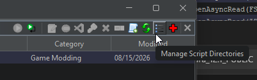
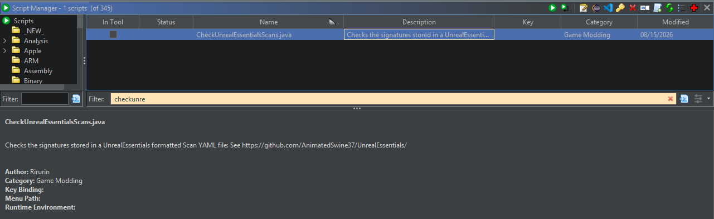
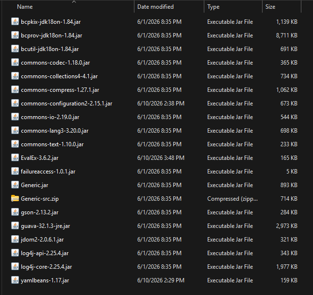

# ghidra-scripts

A collection of my Ghidra scripts used to assist in reverse engineering and game modding. 

Most of the scripts are designed to be utilised on Unreal Engine game executables, along with some stuff targeting games in the Persona series that use Unreal Engine (Persona 3 Reload).

## Installation

The recommended method for installing these scripts is to clone the repo. Then, in the Script Manager in Ghidra, click on Manage Script Directories: \
 \
Then in the bundle manager window, click on the plus icon "Display file chooser to add bundles to the list" and select the directory for the repo. \
The scripts from this repo should now appear in the list: \
 \
If any updates to scripts are released, you can just update your local repo with `git pull` to immediately receive the latest updates for the scripts.

Some of the scripts require extra dependencies that aren't included in Ghidra, which are
- [Apache Commons Configuration](https://commons.apache.org/configuration/download_configuration.cgi)
- [EvalEx](https://github.com/ezylang/EvalEx/)
- [yamlbeans](https://github.com/EsotericSoftware/yamlbeans/)

Download the JAR file for each of these, then insert them into the folder `[GHIDRA DIR]/Ghidra/Framework/Generic/lib`, where `[GHIDRA DIR]` is the folder containing `ghidraRun.bat`: \

## List of Scripts

- `CheckScanINI.java` : Checks the signatures stored in a [RyoTune.Reloaded](https://github.com/RyoTune/RyoTune.Reloaded/) formatted Scan INI file. For example, signatures in UE.Toolkit are defined using this format.
- `CheckUnrealEssentialsScans.java`: Checks the signatures stored in an [UnrealEssentials](https://github.com/AnimatedSwine37/UnrealEssentials/) formatted Scan YAML file.
- `makesig.py`: Creates a memory signature at the current instruction, updated for use in Ghidra 12.x. Running this requires you to start Ghidra by running `support/pyGhidraRun.bat`

Other scripts are either sample/test scripts or are incomplete.